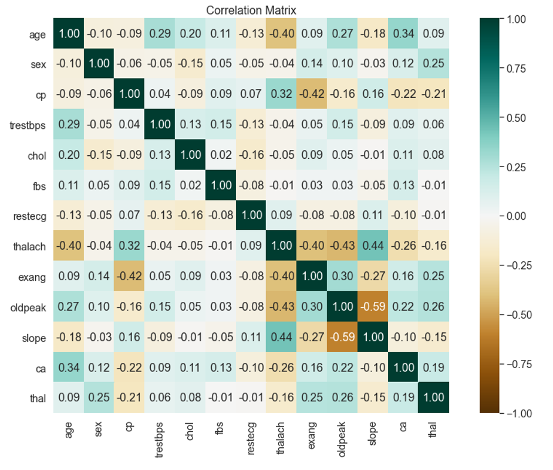

# KNN and Bayes classifier

In this code, we want to predict the probability of heart disease using the KNN and Bayesian classification algorithms.
In the implementation of this algorithm, the sklerone library is used.
Initially, the data is pre-processed and various diagram of data is illustrated. The image below shows the correlation matrix between the different columns of data.

Then new columns for the data are created using the results of correlation of data.
Finally, Bayesian and CNN classification algorithms (with different K) have been implemented on them and accuracy has been shown on the test data.
